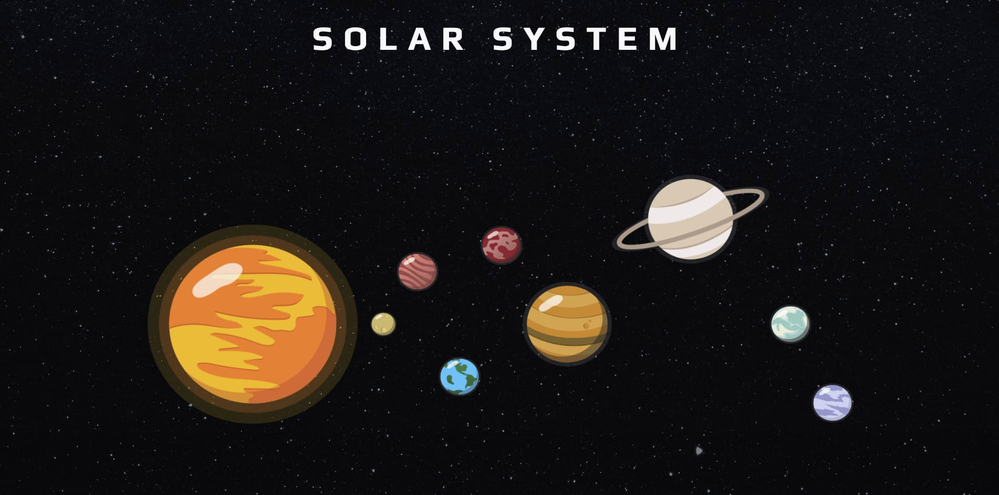
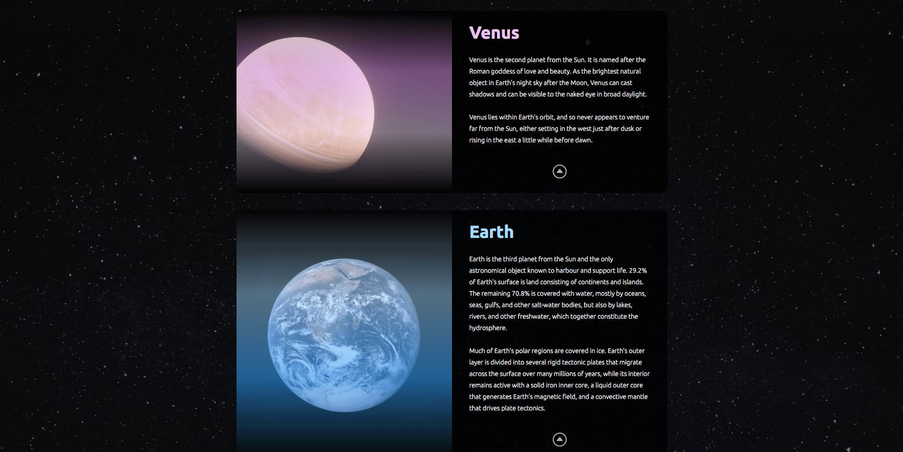

# Solar System website

## Description

This is an interactive website with basic information about our Solar System.

Since I was a kid I've always enjoyed everything related to the universe. I really liked the series "Cosmos" by Carl Sagan, and I used to spend hours trying to build my own Solar System with clay and other materials (never did a good job to be honest).

Now that I have the skills, I decided to try it once again but this time with code!

## Built with

- HTML5
- CSS3

## Screenshots

- Desktop

## Links

[live Site URL](https://sanramu93.github.io/solar-system-website)

## Author

[@sanramu93](https://github.com/sanramu93)

## Version History

- 0.1
  - Initial Release
